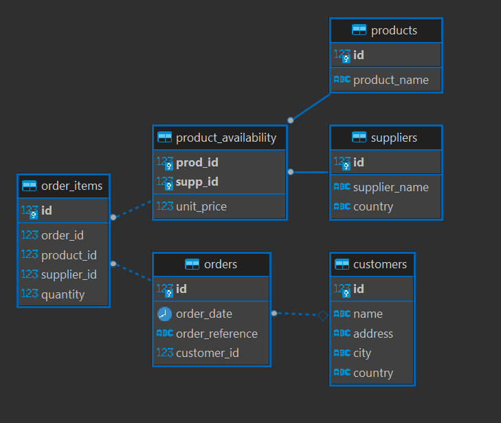

# E-Commerce Database

In this homework, you are going to work with an ecommerce database. In this database, you have `products` that `consumers` can buy from different `suppliers`. Customers can create an `order` and several products can be added in one order.

## Submission

Below you will find a set of tasks for you to complete to set up a database for an e-commerce app.

To submit this homework write the correct commands for each question here:

```
PLEASE SEE BELOW
```

When you have finished all of the questions - open a pull request with your answers to the `Databases-Homework` repository.

## Setup

To prepare your environment for this homework, open a terminal and create a new database called `cyf_ecommerce`:

```sql
createdb cyf_ecommerce
```

Import the file [`cyf_ecommerce.sql`](./cyf_ecommerce.sql) in your newly created database:

```sql
psql -d cyf_ecommerce -f cyf_ecommerce.sql
```

Open the file `cyf_ecommerce.sql` in VSCode and examine the SQL code. Take a piece of paper and draw the database with the different relationships between tables (as defined by the REFERENCES keyword in the CREATE TABLE commands). Identify the foreign keys and make sure you understand the full database schema.

Entity Relation Diagram:  


## Task

Once you understand the database that you are going to work with, solve the following challenge by writing SQL queries using everything you learned about SQL:

1. Retrieve all the customers' names and addresses who live in the United States

```sql
SELECT
  name,
  address,
  city,
  country
FROM customers
WHERE country = 'United States';
```

```
     name     |          address           |       city       |    country
--------------+----------------------------+------------------+---------------
 Amber Tran   | 6967 Ac Road               | Villafranca Asti | United States
 Edan Higgins | Ap #840-3255 Tincidunt St. | Arles            | United States

```

2. Retrieve all the customers in ascending name sequence

```sql
SELECT *
FROM customers
ORDER BY name;
```

```
 id |        name        |           address           |       city       |    country
----+--------------------+-----------------------------+------------------+----------------
  4 | Amber Tran         | 6967 Ac Road                | Villafranca Asti | United States
  3 | Britanney Kirkland | P.O. Box 577, 5601 Sem, St. | Little Rock      | United Kingdom
  5 | Edan Higgins       | Ap #840-3255 Tincidunt St.  | Arles            | United States
  1 | Guy Crawford       | 770-2839 Ligula Road        | Paris            | France
  2 | Hope Crosby        | P.O. Box 276, 4976 Sit Rd.  | Steyr            | United Kingdom
  6 | Quintessa Austin   | 597-2737 Nunc Rd.           | Saint-Marc       | United Kingdom

```

3. Retrieve all the products whose name contains the word `socks`

```sql
SELECT *
FROM products
WHERE product_name
LIKE '%socks%';
```

```
 id |   product_name
----+------------------
  4 | Super warm socks
```

4. Retrieve all the products which cost more than 100 showing product id, name, unit price and supplier id.

```sql
SELECT
  p.id AS product_id,
  p.product_name,
  pa.unit_price,
  pa.supp_id AS supplier_id
FROM products p
INNER JOIN product_availability pa
ON (p.id = pa.prod_id)
WHERE pa.unit_price > 100;
```

```
 product_id |  product_name  | unit_price | supplier_id
------------+----------------+------------+-------------
          1 | Mobile Phone X |        249 |           4
          1 | Mobile Phone X |        299 |           1
```

5. Retrieve the 5 most expensive products

```sql
SELECT
  p.product_name,
  pa.unit_price
FROM products p
INNER JOIN product_availability pa
ON (p.id = pa.prod_id)
ORDER BY pa.unit_price DESC
LIMIT 5;
```

```
  product_name   | unit_price
-----------------+------------
 Mobile Phone X  |        299
 Mobile Phone X  |        249
 Javascript Book |         41
 Javascript Book |         40
 Javascript Book |         39
```

6. Retrieve all the products with their corresponding suppliers. The result should only contain the columns `product_name`, `unit_price` and `supplier_name`

```sql
SELECT
  p.product_name,
  pa.unit_price,
  s.supplier_name
FROM products p
INNER JOIN product_availability pa
ON (p.id = pa.prod_id)
INNER JOIN suppliers s
ON (pa.supp_id = s.id)
ORDER BY pa.unit_price;
```

```
      product_name       | unit_price | supplier_name
-------------------------+------------+---------------
 Coffee Cup              |          3 | Amazon
 Coffee Cup              |          4 | Taobao
 Coffee Cup              |          4 | Argos
 Coffee Cup              |          5 | Sainsburys
 Super warm socks        |          5 | Taobao
 Super warm socks        |          8 | Argos
 Super warm socks        |         10 | Sainsburys
 Le Petit Prince         |         10 | Amazon
 Le Petit Prince         |         10 | Sainsburys
 Super warm socks        |         10 | Amazon
 Ball                    |         14 | Amazon
 Ball                    |         15 | Sainsburys
 Tee Shirt Olympic Games |         18 | Taobao
 Tee Shirt Olympic Games |         20 | Amazon
 Ball                    |         20 | Taobao
 Tee Shirt Olympic Games |         21 | Argos
 Javascript Book         |         39 | Argos
 Javascript Book         |         40 | Amazon
 Javascript Book         |         41 | Taobao
 Mobile Phone X          |        249 | Sainsburys
 Mobile Phone X          |        299 | Amazon
```

7. Retrieve all the products sold by suppliers based in the United Kingdom. The result should only contain the columns `product_name` and `supplier_name`.

```sql
SELECT
  p.product_name,
  s.supplier_name
FROM products p
INNER JOIN product_availability pa
ON (p.id = pa.prod_id)
INNER JOIN suppliers s
ON (pa.supp_id = s.id)
WHERE s.country = 'United Kingdom'
ORDER BY p.product_name;
```

```
      product_name       | supplier_name
-------------------------+---------------
 Ball                    | Sainsburys
 Coffee Cup              | Sainsburys
 Coffee Cup              | Argos
 Javascript Book         | Argos
 Le Petit Prince         | Sainsburys
 Mobile Phone X          | Sainsburys
 Super warm socks        | Sainsburys
 Super warm socks        | Argos
 Tee Shirt Olympic Games | Argos
```

8. Retrieve all orders, including order items, from customer ID `1`. Include order id, reference, date and total cost (calculated as quantity \* unit price).

^These instructions are not clear, I have provided two variations:

```sql
SELECT
  c.id AS customer_id,
  o.id AS order_id,
  o.order_reference,
  o.order_date,
  pa.unit_price * oi.quantity AS total_cost
FROM customers c
INNER JOIN orders o
ON (c.id = o.customer_id)
INNER JOIN order_items oi
ON (o.id = oi.order_id)
INNER JOIN product_availability pa
ON (oi.product_id = pa.prod_id)
AND (oi.supplier_id = pa.supp_id)
INNER JOIN products p
ON (pa.prod_id = p.id)
WHERE c.id = 1;
```

```
 customer_id | order_id | order_reference | order_date | total_cost
-------------+----------+-----------------+------------+------------
           1 |        1 | ORD001          | 2019-06-01 |         18
           1 |        1 | ORD001          | 2019-06-01 |         25
           1 |        2 | ORD002          | 2019-07-15 |         32
           1 |        2 | ORD002          | 2019-07-15 |         10
           1 |        3 | ORD003          | 2019-07-11 |         40
           1 |        3 | ORD003          | 2019-07-11 |         40
```

```sql
SELECT
  c.id AS customer_id
  o.id AS order_id,
  o.order_reference,
  o.order_date,
  SUM(pa.unit_price * oi.quantity) AS total_cost
FROM customers c
INNER JOIN orders o
ON (c.id = o.customer_id)
INNER JOIN order_items oi
ON (o.id = oi.order_id)
INNER JOIN product_availability pa
ON (oi.product_id = pa.prod_id)
AND (oi.supplier_id = pa.supp_id)
INNER JOIN products p
ON (pa.prod_id = p.id)
WHERE c.id = 1
GROUP BY c.id, o.id;
```

```
 customer_id | order_id | order_reference | order_date | total_cost
-------------+----------+-----------------+------------+------------
           1 |        1 | ORD001          | 2019-06-01 |         43
           1 |        2 | ORD002          | 2019-07-15 |         42
           1 |        3 | ORD003          | 2019-07-11 |         80
```

9. Retrieve all orders, including order items, from customer named `Hope Crosby`

```sql
SELECT
  c.name AS customer_name,
  o.id AS order_id,
  o.order_reference,
  o.order_date,
  p.id AS product_id,
  p.product_name,
  pa.unit_price AS product_price,
  oi.quantity,
  s.supplier_name,
  s.country AS supplier_country
FROM customers c
INNER JOIN orders o
ON (c.id = o.customer_id)
INNER JOIN order_items oi
ON (o.id = oi.order_id)
INNER JOIN product_availability pa
ON (oi.product_id = pa.prod_id)
AND (oi.supplier_id = pa.supp_id)
INNER JOIN products p
ON (pa.prod_id = p.id)
INNER JOIN suppliers s
ON (pa.supp_id = s.id)
WHERE name = 'Hope Crosby';
```

```
 customer_name | order_id | order_reference | order_date | product_id |  product_name  | product_price | quantity | supplier_name | supplier_country
---------------+----------+-----------------+------------+------------+----------------+---------------+----------+---------------+------------------
 Hope Crosby   |        4 | ORD004          | 2019-05-24 |          1 | Mobile Phone X |           299 |        1 | Amazon        | United States
```

10. Retrieve all the products in the order `ORD006`. The result should only contain the columns `product_name`, `unit_price` and `quantity`.

I deliberately added the order_reference column for visual clarity.

```sql
SELECT
  o.order_reference,
  p.product_name,
  pa.unit_price,
  oi.quantity
FROM customers c
INNER JOIN orders o
ON (c.id = o.customer_id)
INNER JOIN order_items oi
ON (o.id = oi.order_id)
INNER JOIN product_availability pa
ON (oi.product_id = pa.prod_id)
AND (oi.supplier_id = pa.supp_id)
INNER JOIN products p
ON (pa.prod_id = p.id)
INNER JOIN suppliers s
ON (pa.supp_id = s.id)
WHERE order_reference = 'ORD006';
```

```
 order_reference |   product_name   | unit_price | quantity
-----------------+------------------+------------+----------
 ORD006          | Super warm socks |         10 |        3
 ORD006          | Le Petit Prince  |         10 |        1
 ORD006          | Javascript Book  |         41 |        1
 ORD006          | Coffee Cup       |          4 |        3
```

11. Retrieve all the products with their supplier for all orders of all customers. The result should only contain the columns `name` (from customer), `order_reference`, `order_date`, `product_name`, `supplier_name` and `quantity`.

```sql
SELECT
  c.name,
  o.order_reference,
  o.order_date,
  p.product_name,
  s.supplier_name,
  oi.quantity
FROM customers c
INNER JOIN orders o
ON (c.id = o.customer_id)
INNER JOIN order_items oi
ON (o.id = oi.order_id)
INNER JOIN product_availability pa
ON (oi.product_id = pa.prod_id)
AND (oi.supplier_id = pa.supp_id)
INNER JOIN products p
ON (pa.prod_id = p.id)
INNER JOIN suppliers s
ON (pa.supp_id = s.id);
```

```
        name        | order_reference | order_date |      product_name       | supplier_name | quantity
--------------------+-----------------+------------+-------------------------+---------------+----------
 Guy Crawford       | ORD001          | 2019-06-01 | Tee Shirt Olympic Games | Taobao        |        1
 Guy Crawford       | ORD001          | 2019-06-01 | Super warm socks        | Taobao        |        5
 Guy Crawford       | ORD002          | 2019-07-15 | Super warm socks        | Argos         |        4
 Guy Crawford       | ORD002          | 2019-07-15 | Le Petit Prince         | Sainsburys    |        1
 Guy Crawford       | ORD003          | 2019-07-11 | Coffee Cup              | Argos         |       10
 Guy Crawford       | ORD003          | 2019-07-11 | Ball                    | Taobao        |        2
 Hope Crosby        | ORD004          | 2019-05-24 | Mobile Phone X          | Amazon        |        1
 Britanney Kirkland | ORD005          | 2019-05-30 | Javascript Book         | Argos         |        2
 Britanney Kirkland | ORD005          | 2019-05-30 | Le Petit Prince         | Amazon        |        1
 Amber Tran         | ORD006          | 2019-07-05 | Coffee Cup              | Taobao        |        3
 Amber Tran         | ORD006          | 2019-07-05 | Javascript Book         | Taobao        |        1
 Amber Tran         | ORD006          | 2019-07-05 | Le Petit Prince         | Sainsburys    |        1
 Amber Tran         | ORD006          | 2019-07-05 | Super warm socks        | Sainsburys    |        3
 Amber Tran         | ORD007          | 2019-04-05 | Super warm socks        | Argos         |       15
 Edan Higgins       | ORD008          | 2019-07-23 | Tee Shirt Olympic Games | Amazon        |        1
 Edan Higgins       | ORD008          | 2019-07-23 | Mobile Phone X          | Sainsburys    |        1
 Edan Higgins       | ORD009          | 2019-07-24 | Ball                    | Sainsburys    |        2
 Edan Higgins       | ORD010          | 2019-05-10 | Ball                    | Taobao        |        1
 Edan Higgins       | ORD010          | 2019-05-10 | Super warm socks        | Amazon        |        5
```

12. Retrieve the names of all customers who bought a product from a supplier based in China.

```sql
SELECT
  c.name AS customer_name,
  s.country AS supplier_country
FROM customers c
INNER JOIN orders o
ON (c.id = o.customer_id)
INNER JOIN order_items oi
ON (o.id = oi.order_id)
INNER JOIN product_availability pa
ON (oi.product_id = pa.prod_id)
AND (oi.supplier_id = pa.supp_id)
INNER JOIN suppliers s
ON (pa.supp_id = s.id)
WHERE s.country  = 'China'
GROUP BY c.name, s.country;
```

```
 customer_name | supplier_country
---------------+------------------
 Amber Tran    | China
 Edan Higgins  | China
 Guy Crawford  | China
```

13. List all orders giving customer name, order reference, order date and order total amount (quantity \* unit price) in descending order of total.

```sql
SELECT
  c.name AS customer_name,
  o.order_reference,
  o.order_date,
  SUM(pa.unit_price * oi.quantity) AS order_total_amount
FROM customers c
INNER JOIN orders o
ON (c.id = o.customer_id)
INNER JOIN order_items oi
ON (o.id = oi.order_id)
INNER JOIN product_availability pa
ON (oi.product_id = pa.prod_id)
AND (oi.supplier_id = pa.supp_id)
INNER JOIN products p
ON (pa.prod_id = p.id)
GROUP BY o.id, c.name
ORDER BY order_total_amount DESC;
```

```
   customer_name    | order_reference | order_date | order_total_amount
--------------------+-----------------+------------+--------------------
 Hope Crosby        | ORD004          | 2019-05-24 |                299
 Edan Higgins       | ORD008          | 2019-07-23 |                269
 Amber Tran         | ORD007          | 2019-04-05 |                120
 Amber Tran         | ORD006          | 2019-07-05 |                 93
 Britanney Kirkland | ORD005          | 2019-05-30 |                 88
 Guy Crawford       | ORD003          | 2019-07-11 |                 80
 Edan Higgins       | ORD010          | 2019-05-10 |                 70
 Guy Crawford       | ORD001          | 2019-06-01 |                 43
 Guy Crawford       | ORD002          | 2019-07-15 |                 42
 Edan Higgins       | ORD009          | 2019-07-24 |                 30
```
