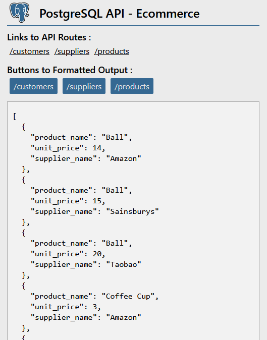

# PostgreSQL Ecommerce API

## Screenshot:

## Instructions:

1. clone this repo
2. install [postgresql](https://www.postgresql.org/)
3. inside the root of the repository, open a terminal:
4. move into the `2-exercises` folder:  
   `cd 2-exercises`
5. create the database  
   `createdb cyf_ecommerce`
6. populate the database  
   `createdb -d cyf_ecommerce -f cyf-cyf_ecommerce.sql`
7. move to the api directory:  
   `cd ../3-projects/cyf-ecommerce-api`
8. install the project dependencies:  
   `npm install`
9. start the server in develoment mode:  
   `npm run dev`
10. visit http://localhost:3000

**Note: this project assumes you are connecting to the database with:**  
`username: postgres`  
`password: password`
